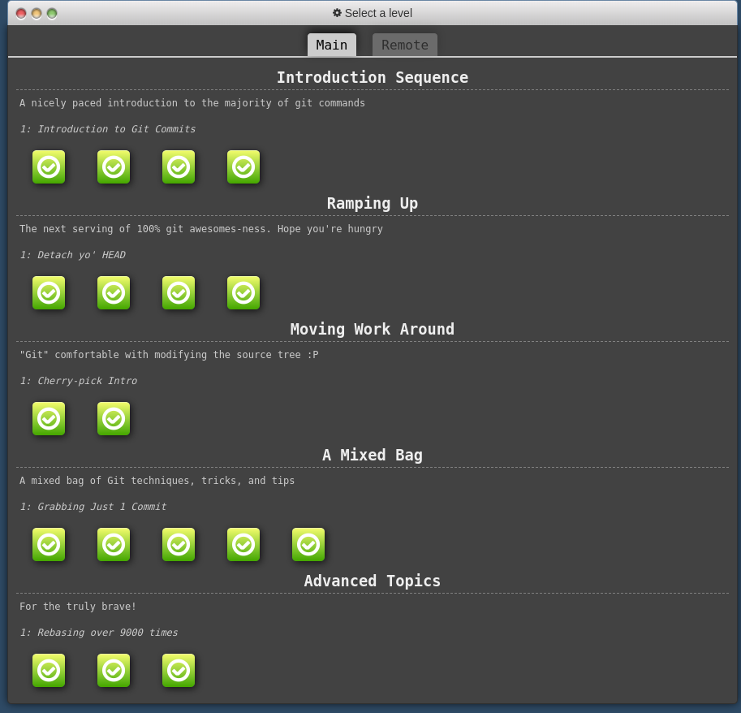

# Урок № 1

## Задания

-   [x] 1.Задание 
    -   С помощью встроенной браузерной функции prompt поочерёдно ввести два значения. Если оба значения являются валидными числами, то вывести в консоли результат в виде первого числа в системе счисления второго. 
        Если хотя бы одно из введённых значений является некорректным числом, вывести в консоли сообщение: "Некорректный ввод!" и завершить программу.
         
-   [x] 2. Задание  
       * С помощью встроенной браузерной функции prompt поочерёдно ввести два значения. Если оба значения являются валидными числами, то вывести в консоли результат в виде первого числа в системе счисления второго. 
          Если хотя бы одно из введённых значений является некорректным числом, вывести в консоли сообщение: "Некорректный ввод!" и завершить программу. 
          Примеры: 
          Вводим 10 и 2, получаем 1010  
          Вводим 872 и 8, получаем 1550  
          Вводим 2 и 'abc', получаем "Некорректный ввод!"  
       * С помощью встроенной браузерной функции prompt поочерёдно ввести два значения. Если первое значение является невалидным числом, вывести в консоли сообщение: "Некорректный ввод!" и завершить программу. В ином случае, если второе значение является невалидным числом вывести такое же сообщение об ошибке и завершить программу. Если оба значения являются валидными числами, то вывести в консоль результат в виде: "Ответ: [сумма двух чисел], [частное двух чисел]."   > Примеры:  > Вводим 10 и 2, получаем "Ответ: 12, 5."  > Вводим 872 и 8, получаем "Ответ: 880, 109."  > Вводим 'abc', получаем "Некорректный ввод!" 
- [x] 3. Задание
    * Пройти задания по гиту на [сайте](https://learngitbranching.js.org/)
        
